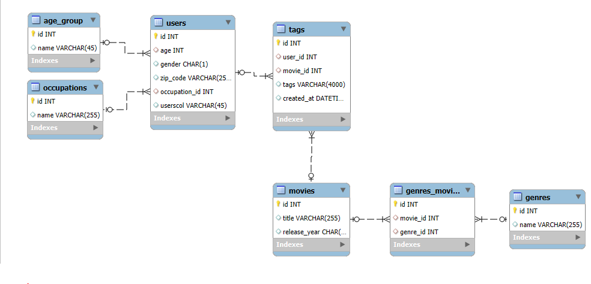
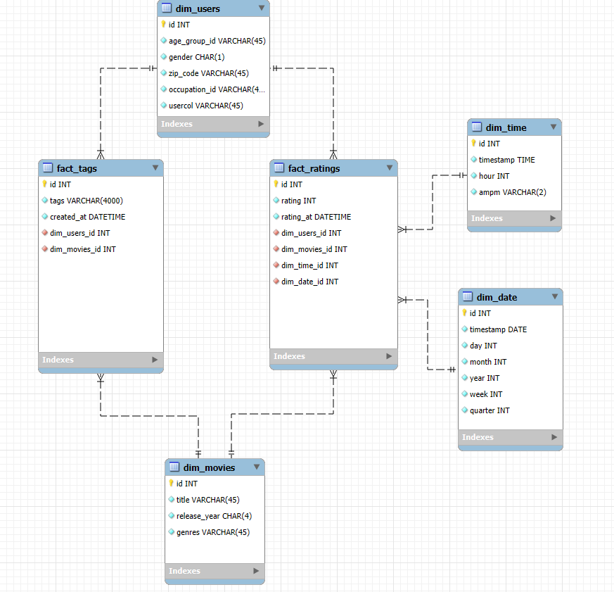
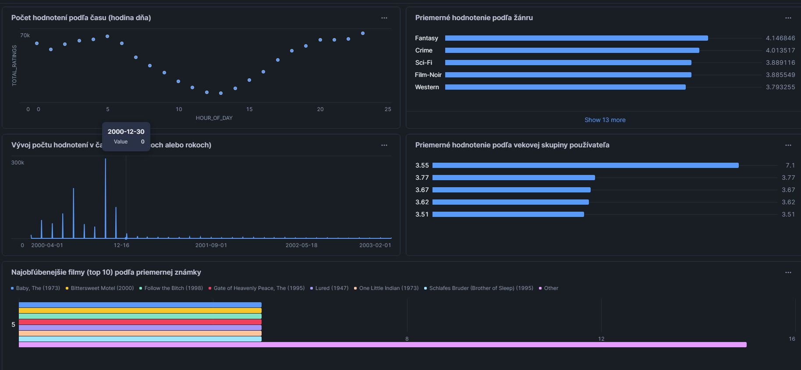

# Movielens
School project

1. Krátke vysvetlenie témy projektu MovieLens, typ dát a účel analýzy:
Projekt MovieLens predstavuje rozsiahlu databázu filmových hodnotení vytvorených používateľmi. Obsahuje dáta o filmoch, používateľoch a ich hodnoteniach (ratings), prípadne aj tagy, či časové údaje o hodnoteniach. Tieto údaje sú typicky využívané na tvorbu odporúčacích systémov (recommendation systems), analýzy preferencií používateľov, skúmanie popularít žánrov, filmov a pod.

1.1 Typ dát:
Hlavne textové atribúty (názvy filmov, žánre, mená používateľov a ich charakteristiky), číselné (hodnotenia, ID, roky, dátumy), dátovo-časové (čas/ dátum hodnotenia).
Účel analýzy: cieľom je získať prehľad o tom, aké filmy sa najviac hodnotia, aké žánre sú obľúbené, akí používatelia ich hodnotia, v akom čase prebieha najviac hodnotení či ako sa hodnotenia menia naprieč demografickými ukazovateľmi.

2. Základný popis každej tabuľky zo zdrojových dát a ich význam:

Movies 
Hlavné stĺpce: movieId, title, genres
Význam: Zahŕňa informácie o filmoch, ich názvy a žánre. Pre analýzy môžeme filmovú entitu spájať s konkrétnymi hodnoteniami.

Ratings
Hlavné stĺpce: userId, movieId, rating, timestamp
Význam: Zaznamenávajú hodnotenia filmov jednotlivými používateľmi na škále od 0,5 po 5 (podľa verzie datasetu). timestamp predstavuje čas vytvorenia hodnotenia.

Tags
Hlavné stĺpce: userId, movieId, tag, timestamp
Význam: Umožňujú používateľom priraďovať k filmom tagy (krátke textové popisy, napr. “thriller”, “based on a true story”), ktoré vystihujú film z pohľadu používateľa.

Users
Hlavné stĺpce: userId, prípadne demografické informácie (pohlavie, veková skupina, povolanie, PSČ a pod.) – to závisí od verzie datasetu.
Význam: Obsahuje informácie o demografii a iných atribútoch používateľov, na základe ktorých môžeme analyzovať rozdiely v preferenciách.

Time/Date
Vo väčšine datasetov MovieLens čas nie je v samostatnej tabuľke, ale je uložený v stĺpci timestamp. Pri potrebe detailných analýz (napr. dňa v týždni, času počas dňa) sa zvyčajne extrahuje do samostatnej tabuľky.
(Názvy tabuliek sa môžu mierne líšiť podľa konkrétnej verzie datasetu, ale princíp ostáva rovnaký.)

3. ERD diagram pôvodnej štruktúry zdrojových dát

Nižšie je príklad jednoduchej schémy vzťahov (pôvodná štruktúra MovieLens datasetu). Vzťahy sú:

Ratings je prepojovacia tabuľka medzi Users a Movies (1 používateľ môže ohodnotiť viac filmov, 1 film môže byť ohodnotený viacerými používateľmi).
Tags je obdobne prepojovacia tabuľka medzi Users a Movies (1 používateľ môže pridávať tagy k viacerým filmom a 1 film môže mať viacero tagov).

Prípadne, ak existuje samostatná tabuľka Time/Date, tak Ratings a Tags budú mať cudzie kľúče na túto tabuľku.

Návrh dimenzionálneho modelu typu hviezda (Hviezdička)

V dimenzionálnom modeli zvyčajne zoskupíme číselné a merateľné údaje do jednej faktovej tabuľky a opisné údaje do dimenzných tabuliek.

Faktová tabuľka:
fact_ratings (obsahuje všetky merateľné údaje: rating, počet hodnotení, dátum hodnotenia, a kľúče na dimenzie)

Dimenzie:
dim_users 
dim_movies 
dim_date 
dim_tags 

3.1 ERD dimenzionálneho modelu (Hviezdička):

3.2Popis tabuliek v dimenzionálnom modeli

Faktová tabuľka: fact_ratings

Kľúče:
id (primárny kľúč faktu)
user_id (cudzie kľúče do dim_users)
movie_id (cudzie kľúče do dim_movies)
date_id (cudzie kľúče do dim_date)
time_id (cudzie kľúče do dim_time)

Hlavné metriky:
rating – hodnotenie od 0,5 do 5 (napr. “hviezdičky”).

Účel:
Umožňuje analyzovať, ako sa ratingy menia podľa používateľa, filmu, času, dňa v týždni a ďalších atribútov z dimenzií.

Dimenzná tabuľka: dim_users
Kľúč:
id 

Atribúty:
age_group
gender
occupation
zip_code
usercol

Dimenzná tabuľka: dim_movies
Kľúč:
id

Atribúty:
title
release_year
genres

Dimenzná tabuľka: dim_date
Kľúč:
id

Atribúty:
full_date
day, month, year, quarter, week, timestamp

Dimenzná tabuľka: dim_time
Kľúč:
id

Atribúty:
hour, timestamp, ampm

4. ETL proces v nástroji Snowflake

Extrakcia:

Načítanie zdrojových súborov (CSV predtým importovane do myphpadmin a nasledne exportovane) z MovieLens do staging zóny v Snowflake.
Hlavný SQL príkaz(príklad): COPY INTO movies (id, title, release_year)
FROM @MOVIELENS_MOVIELENS/movies.csv
FILE_FORMAT = (TYPE = 'CSV' FIELD_OPTIONALLY_ENCLOSED_BY = '"' SKIP_HEADER = 1);
SELECT * FROM movies LIMIT 10; -- na testovanie či príkaz prebehol správne a načítalo údaje
Účel: zabezpečiť, aby dáta boli fyzicky “nahrané” do Snowflake.

5. Transfor (Transformácia dát)
Vytvorenie dimenzných tabuliek
Dimenzia dim_users
Transformácia používateľov, rozdelenie veku do kategórií a obohatenie údajov:

CREATE TABLE dim_users AS
SELECT DISTINCT
    u.id AS dim_user_id,
    CASE 
        WHEN u.age < 18 THEN 'Under 18'
        WHEN u.age BETWEEN 18 AND 24 THEN '18-24'
        WHEN u.age BETWEEN 25 AND 34 THEN '25-34'
        WHEN u.age BETWEEN 35 AND 44 THEN '35-44'
        WHEN u.age BETWEEN 45 AND 54 THEN '45-54'
        WHEN u.age >= 55 THEN '55+'
        ELSE 'Unknown'
    END AS age_group,
    u.gender,
    o.name AS occupation
FROM users u
LEFT JOIN occupations o ON u.occupation_id = o.id;

Transformácia dát
Vytvorenie dimenzných tabuliek
Dimenzia dim_users

5.1 Transformácia používateľov, rozdelenie veku do kategórií a obohatenie údajov:

CREATE TABLE dim_users AS
SELECT DISTINCT
    u.id AS dim_user_id,
    CASE 
        WHEN u.age < 18 THEN 'Under 18'
        WHEN u.age BETWEEN 18 AND 24 THEN '18-24'
        WHEN u.age BETWEEN 25 AND 34 THEN '25-34'
        WHEN u.age BETWEEN 35 AND 44 THEN '35-44'
        WHEN u.age BETWEEN 45 AND 54 THEN '45-54'
        WHEN u.age >= 55 THEN '55+'
        ELSE 'Unknown'
    END AS age_group,
    u.gender,
    o.name AS occupation
FROM users u
LEFT JOIN occupations o ON u.occupation_id = o.id;

Dimenzia dim_movies
Transformácia údajov o filmoch:

CREATE TABLE dim_movies AS
SELECT DISTINCT
    m.id AS dim_movie_id,
    m.title,
    m.release_year
FROM movies m;
Dimenzia dim_genres
Žánre sú už pripravené. Môžeš ich skontrolovať:

SELECT * FROM genres;
Dimenzia dim_age_group
Transformácia kategórií veku (ak je potrebné):

CREATE TABLE dim_age_group AS
SELECT 
    id AS dim_age_group_id,
    name AS age_group
FROM age_group;
Dimenzia dim_occupations
Transformácia zamestnaní:

CREATE TABLE dim_occupations AS
SELECT 
    id AS dim_occupation_id,
    name AS occupation
FROM occupations;

Vytvorenie faktovej tabuľky fact_ratings
Transformácia faktov o hodnoteniach, ktoré obsahujú odkazy na dimenzné tabuľky:

CREATE TABLE fact_ratings AS
SELECT 
    r.id AS fact_rating_id,
    r.rating,
    r.rated_at AS timestamp,
    u.dim_user_id AS user_id,
    m.dim_movie_id AS movie_id
FROM ratings r
JOIN dim_users u ON r.user_id = u.dim_user_id
JOIN dim_movies m ON r.movie_id = m.dim_movie_id;

5.2 Načítanie a čistenie staging tabuliek
Odstránenie staging tabuliek po načítaní dát:

DROP TABLE IF EXISTS age_group;
DROP TABLE IF EXISTS genres;
DROP TABLE IF EXISTS genres_movies;
DROP TABLE IF EXISTS movies;
DROP TABLE IF EXISTS occupations;
DROP TABLE IF EXISTS ratings;
DROP TABLE IF EXISTS tags;
DROP TABLE IF EXISTS users;

Popis transformácie
Dimenzia dim_users:
Zahŕňa používateľov s kategorizovanými vekovými skupinami a zamestnaniami.
Dimenzia dim_movies:
Obsahuje údaje o filmoch, ako sú názov a rok vydania.
Faktová tabuľka fact_ratings:
Obsahuje všetky hodnotenia s odkazmi na dimenzie.

6. Vizualizácia dát 5 grafov:

1. Počet hodnotení podľa času (hodina dňa)
Čo zobrazuje: Stĺpcový graf zobrazujúci počet hodnotení filmov pre každú hodinu dňa (0–23).
Otázka: „Kedy počas dňa sú používatelia najaktívnejší v hodnotení filmov?“
Pomáha identifikovať časové úseky s najvyššou a najnižšou aktivitou používateľov.

2. Priemerné hodnotenie podľa žánru
Čo zobrazuje: Stĺpcový alebo bodový graf, ktorý ukazuje priemerné hodnotenia pre jednotlivé žánre (napr. akčné, komédie, drámy...).
Otázka: „Ktoré žánre majú v priemere najvyššie hodnotenia a ktoré najnižšie?“
Interpretácia: Pomáha zistiť preferencie používateľov pre rôzne žánre a identifikovať obľúbené či menej populárne kategórie.

3. Vývoj počtu hodnotení v čase (po mesiacoch alebo rokoch)
Čo zobrazuje: Čiarový graf ukazujúci počet hodnotení v priebehu času (mesiac/rok).
Otázka: „Ako sa menil počet hodnotení naprieč časom? Kedy dosiahli maximum?“
Interpretácia: Poskytuje prehľad o trendoch v hodnoteniach, vrátane sezónnych či dlhodobých zmien v aktivite používateľov.

4. Priemerné hodnotenie podľa vekovej skupiny používateľa
Čo zobrazuje: Zoskupený stĺpcový graf zobrazujúci priemerné hodnotenie pre jednotlivé vekové skupiny (napr. <18, 18–24, 25–34...).
Otázka: „Existujú výrazné rozdiely v priemernom hodnotení u rôznych vekových skupín?“
Interpretácia: Pomáha analyzovať, ako vek ovplyvňuje hodnotenie filmov a či niektoré skupiny hodnotia prísnejšie alebo miernejšie.

5. Najobľúbenejšie filmy (top 10) podľa priemernej známky
Čo zobrazuje: Stĺpcový alebo horizontálny barový graf, ktorý ukazuje 10 filmov s najvyšším priemerným hodnotením.
Otázka: „Ktoré filmy sú hodnotené najlepšie v rámci celej databázy?“
Interpretácia: Identifikuje najlepšie hodnotené filmy, ktoré môžu byť považované za najobľúbenejšie alebo najkvalitnejšie podľa používateľov.

Martin Riziky